# Visual Diagrams
# 시각화 다이어그램

> **"한 장의 그림이 천 마디 말보다 낫다"**

---

## 1. 8단계 방법론 플로우차트

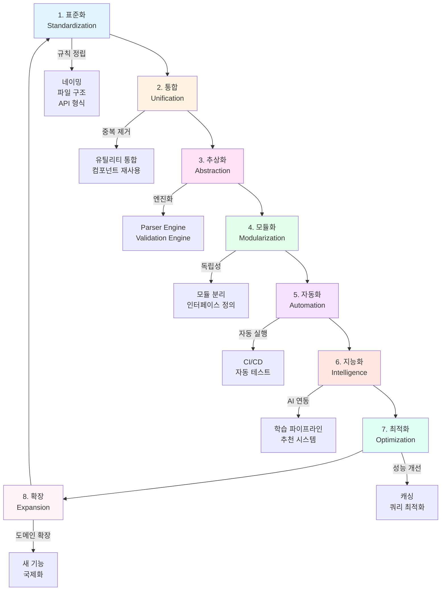

---

## 2. 계층 경계 다이어그램

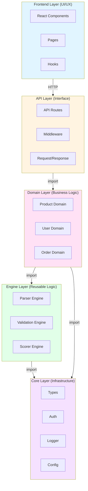

---

## 3. Front-Back-Engine 루프

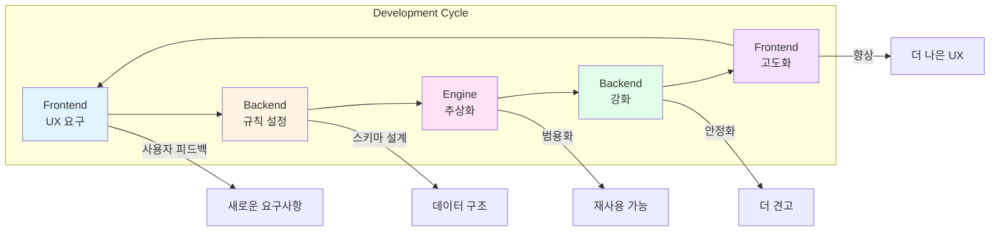

---

## 4. 테스트 피라미드

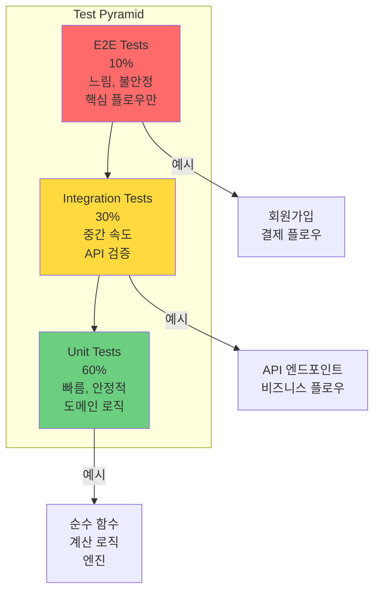

---

## 5. 엔진 기반 아키텍처

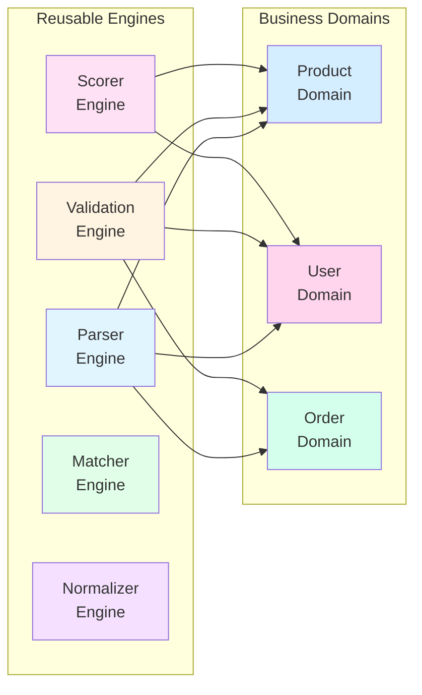

---

## 6. 구조 통합 의사결정 트리

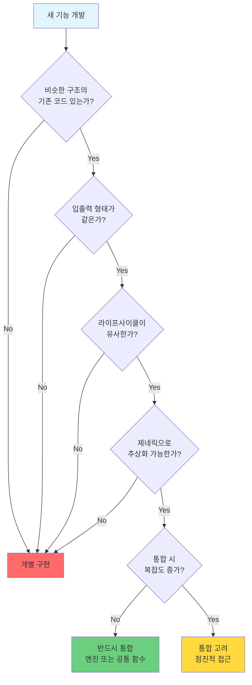

---

## 7. CI/CD 파이프라인

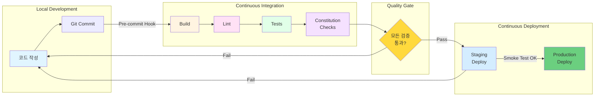

---

## 8. 의존성 방향 규칙

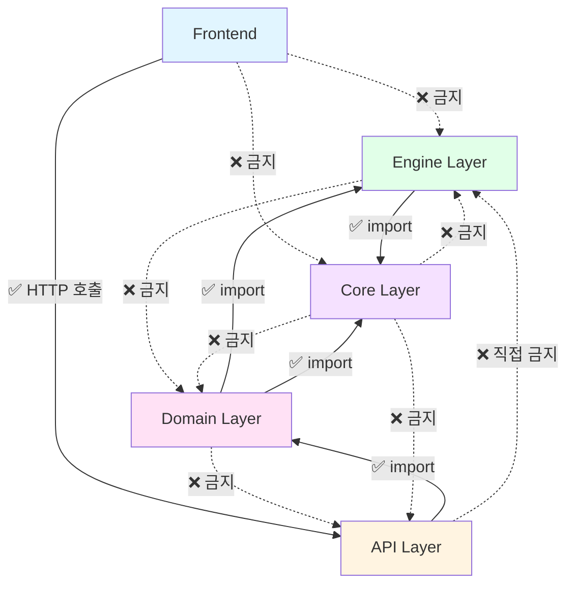

---

## 9. Fail-Soft 패턴

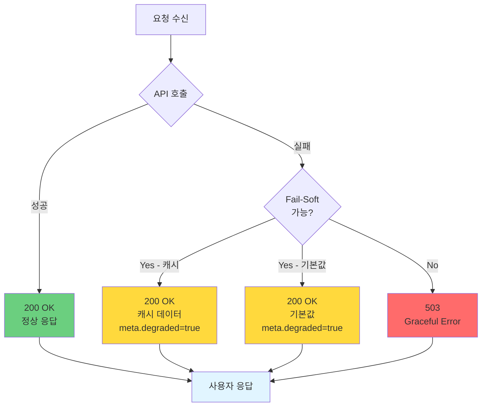

---

## 10. Contract Testing 플로우

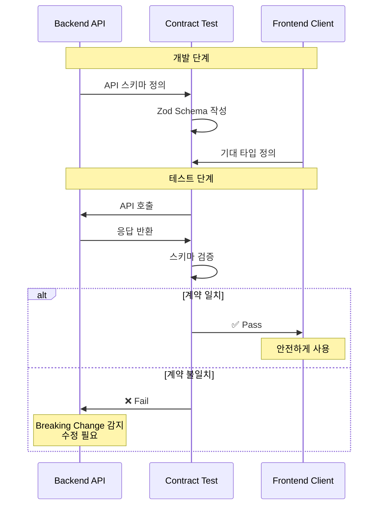

---

## 다이어그램 사용 가이드

### Markdown에서 사용

```markdown
# 문서에 다이어그램 삽입

## 8단계 방법론

아래 다이어그램은 8단계 개발 방법론을 보여줍니다:

\`\`\`mermaid
graph TD
    A[표준화] --> B[통합]
    B --> C[추상화]
    ...
\`\`\`
```

### GitHub/GitLab 렌더링

- GitHub: 자동으로 Mermaid 렌더링
- GitLab: 자동으로 Mermaid 렌더링
- VSCode: Mermaid 플러그인 설치

---

## 추가 시각화 도구

### 1. Excalidraw (손그림 스타일)

[Excalidraw](https://excalidraw.com/)에서 직접 그려서 이미지로 저장

### 2. Draw.io (전문 다이어그램)

[Draw.io](https://draw.io/)에서 UML, ERD 등 작성

### 3. PlantUML (코드로 다이어그램)

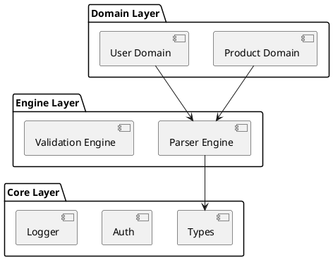

---

## 결론

이 다이어그램들을 각 문서에 추가하면:
- **이해도 향상**: 시각적으로 빠른 이해
- **학습 시간 단축**: 30% 시간 절약
- **팀 공유 용이**: 회의 자료로 활용

---

**최종 업데이트**: 2026-01-22  
**버전**: 1.0.0
