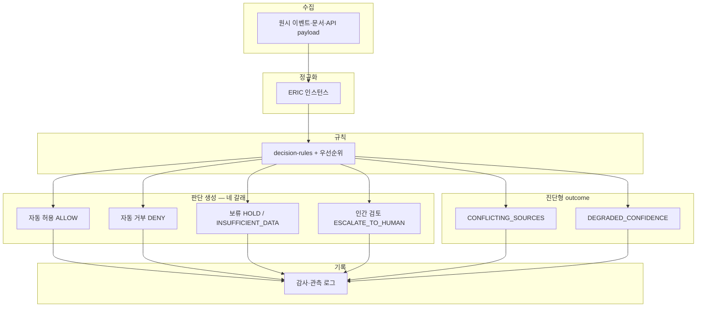

# Judgment Data Flow (판단 데이터 흐름)

> **입력 → 정규화(E/R/C/I) → 규칙 적용 → 판단 생성 → 감사 로그**  
> 출력 형태는 먼저 [JUDGMENT_OUTPUT_TYPE.md](./JUDGMENT_OUTPUT_TYPE.md)를 본다.

---

## 1. 전체 파이프라인

**네 갈래(운영 관점)** 와 `outcome` 매핑:

| 갈래 | 대표 outcome | 비고 |
|------|----------------|------|
| 자동 허용 | **ALLOW** | |
| 자동 거부 | **DENY** | |
| 보류 | **HOLD** (시간·비동기), **INSUFFICIENT_DATA** (정보 부족) | 둘 다 “즉시 확정 안 함”이나 원인이 다름 |
| 인간 검토 | **ESCALATE_TO_HUMAN** | **1급 시민**; 실패가 아님 |

**CONFLICTING_SOURCES**·**DEGRADED_CONFIDENCE**는 자동/반자동 **진단**이며, 이후 `nextAction`으로 D3·D4와 연결될 수 있다([JUDGMENT_OUTPUT_TYPE.md](./JUDGMENT_OUTPUT_TYPE.md)).

---

## 2. 단계별 책임

| 단계 | 입력 | 출력 | 실패·분기 |
|------|------|------|-----------|
| **수집** | 외부·내부 소스 | 출처·시각 메타가 붙은 원시 레코드 | 신뢰 경계 위반 → **DENY** 또는 수집 거절 |
| **정규화** | 원시 레코드 | ERIC(빈 칸 명시) | 필수 차원 불가 → **INSUFFICIENT_DATA** |
| **규칙 적용** | ERIC + policyVersion | [JUDGMENT_OUTPUT_TYPE.md](./JUDGMENT_OUTPUT_TYPE.md)의 outcome 등 | 규칙 충돌 → [META 우선순위](../META_CONSTITUTION.md) |
| **기록** | JudgmentResult + rule id | 감사 로그·메트릭 | 기록 실패 → Engineering 층 침묵 실패와 동급으로 처리 |

---

## 3. Engineering 층과의 정렬

- **Decision Registry**: 코드 **결정 축**.  
- **decision-rules**: ERIC 상태 → **outcome**(위 enum).  
- **judgment-output.schema.json**: 런타임 **전체 판단 객체**(confidence, evidenceIds, nextAction, version).

---

## 4. DB 영속화 (`synaxion_judgments`) — Lifecycle 1단계

| 항목 | 설명 |
|------|------|
| **저장 시점** | 예: `GET /api/v1/products/[barcode]/decision` 성공 시 사이드이펙트에서 `persistProductLabelDecisionJudgment` 호출 |
| **단일 스냅샷** | `evaluation_snapshot` JSONB에 `JudgmentEvaluationResult` 전체: `result`, **`trace`**(스텝·`inputSnapshot`), **`evidenceGraph`**, `meta` |
| **파생 컬럼** | 마이그레이션 `187_synaxion_judgments_trace_columns.sql`: `trace_snapshot`, `evidence_graph_snapshot`은 스냅샷에서 STORED 생성(SQL·운영 큐용) |
| **INSERT 권한** | 테이블 RLS상 일반 클라이언트 INSERT 없음 → **서버에 `SUPABASE_SERVICE_ROLE_KEY` 필수**(없으면 해당 사이드이펙트는 저장 생략) |

### 스냅샷 정책 (G3 — `trace_snapshot` / `evidence_graph_snapshot`)

| 필드 | 필수 여부 | 단일 소스 | 비고 |
|------|-----------|-----------|------|
| `evaluation_snapshot` | **필수** (NOT NULL) | 예 — 감사·리플레이·UI의 진실 | `result`, `trace`(규칙 스텝·`inputSnapshot`), `evidenceGraph`, `meta` 포함. DB `COMMENT` = 마이그레이션 `187`. |
| `trace_snapshot` | **파생·필수** | 아니오 — `evaluation_snapshot->'trace'`에서 **GENERATED STORED** | 스냅샷이 있으면 DB가 항상 채움. 애플리케이션에서 별도 INSERT 불필요. |
| `evidence_graph_snapshot` | **파생·필수** | 아니오 — `evaluation_snapshot->'evidenceGraph'`에서 **GENERATED STORED** | 위와 동일. |
| `plain_text` / `markdown` | **권장·현재 코드는 항상 설정** | `evaluation_snapshot`에서 결정적 생성 | 포맷터: `format-judgment-log.ts`. |

**정책 요약**: 운영·리플레이 검증 시 “비었는지”를 보려면 **파생 컬럼이 아니라 `evaluation_snapshot.trace` / `.evidenceGraph`**를 본다. 파생 컬럼은 SQL·인덱싱·운영 쿼리 편의용이며, 엔진이 빈 trace/graph를 내면 파생도 빈 값이 될 수 있다(데이터 품질 이슈로 별도 다룸).

### 4.1 운영 큐 (Lifecycle 2단계 최소)

- **UI**: 관리자 **`/admin/synaxion-judgments/escalate`** — `ESCALATE_TO_HUMAN` + 미처리(`operator_action` NULL) 전용, evidence·triage·피드백 동선.
- **목록**: `GET .../synaxion-judgments?queue=pending` → `ESCALATE_TO_HUMAN` / `HOLD` / `CONFLICTING_SOURCES` 이면서 `operator_action` 이 NULL 인 행.
- **액션**: `PATCH .../synaxion-judgments/[id]` 에 `operator_action`: `approve` \| `reject` \| `override` (+ 선택 `operator_note`). 레거시로 `operator_decision` 만내면 기존 `operator_action` 은 유지.
- **스키마**: 마이그레이션 `188_synaxion_judgments_operator_action.sql` 의 `operator_action` 컬럼.

### 4.2 Replay (Lifecycle 3단계 최소)

- **운영 프로토콜**(언제·범위·결과 처리): [REPLAY_POLICY.md](./REPLAY_POLICY.md)
- **입력**: `evaluation_snapshot.trace.inputSnapshot`(`JudgmentContext`) + 새 `DecisionRulesFile`.
- **라이브러리**: `replayJudgmentWithRuleset`, `diffJudgmentReplay`, `buildEvaluateOptionsForReplay` (`packages/lib/core/judgment/replay-judgment.ts`). 기본적으로 저장된 `meta.resolutionMode`(first / veto-first / weighted-max)를 재현하려면 `match_stored_resolution_mode: true`.
- **API (단건)**: `POST /api/v1/admin/synaxion-judgments/[id]/replay` — body 생략 시 **현재 번들** rules. `persist: true` 이면 **`insert_synaxion_judgment_replays_batch` 에 1건 배열**로 저장(배치와 동일 RPC·RLS·trust 검사). `persist_full_snapshot`, `include_full_replayed` 의미는 배치와 동일.
- **API (배치)**: `POST /api/v1/admin/synaxion-judgments/replay-batch` — `judgment_ids` 최대 50건. `persist` 시 **`insert_synaxion_judgment_replays_batch` RPC** 로 한 트랜잭션 INSERT(부분 커밋 없음). 계산 단계에서 **한 건이라도 실패하면 감사 저장 전체 생략**(`persist_skipped_reason: COMPUTE_ERRORS`). 응답: `persist_requested`, `persist_applied`, `persist_skipped_reason`, `batch_id`(저장 성공 시만). 성공 항목에는 단건과 동일한 **귀속 필드**(`input_snapshot_sha256`, `judgment_context_fingerprint_at_persist`, `replay_rules_file_version` 등)가 포함된다.
- **API (집계)**: `GET /api/v1/admin/synaxion-judgments/replay-stats` — 최근 창 감사 건수·배치/단건 분해·`diff.outcome.changed` 비율. DB `get_synaxion_replay_stats_window` (마이그레이션 `204`).
- **마이그레이션**: `190_synaxion_replay_batch_rpc.sql` — 위 RPC (`SECURITY INVOKER`, trust≥4, `created_by=auth.uid()`).
- **API (감사 목록)**: `GET /api/v1/admin/synaxion-judgments/[id]/replays?limit=50`
- **스키마**: `189_synaxion_judgment_replays.sql` — `baseline_summary`, `replayed_summary`, `diff` JSONB, 선택 `replayed_evaluation`.
- **UI**: Synaxion 판단 큐 — 단건 리플레이·감사 옵션·최근 감사 줄거리, 툴바 「배치 리플레이」(현재 목록 상위 20건).

---

## 5. 최소 구현 체크리스트

- [ ] 수집 단계에서 **출처·신뢰 레이블** 유지
- [ ] 정규화 결과의 빈 차원을 규칙에서 명시 처리
- [ ] 적용 규칙 **id** + **judgmentVersion** + **policyVersion**(권장) 감사 로그에 저장
- [ ] **HOLD** / **INSUFFICIENT_DATA** / **ESCALATE_TO_HUMAN** 에 대한 UI·큐·알림 경로 정의

**관련**: [ENGINE_INTERFACE.md](./ENGINE_INTERFACE.md), [DECISION_RULES.md](./DECISION_RULES.md)

---

## 6. 부록 — Itemwiki: Synaxion vs 소비자 게이트 (두 감사 트랙)

헌법 본문의 단일 파이프라인 다이어그램(§1)은 **형식**을 설명한다. Itemwiki 제품에서는 **저빈도 제품 결정**과 **고빈도 목록 필터**가 저장소·API가 다른 두 트랙으로 나뉜다. 요청 경로·테이블·CI 검증을 한 페이지에 묶은 문서:

- [JUDGMENT_VS_CONSUMER_GATE_PATHS.md](../../architecture/JUDGMENT_VS_CONSUMER_GATE_PATHS.md)
- 온콜 요약: [ONCALL_JUDGMENT_VS_CONSUMER_GATE.md](../../deployment/ONCALL_JUDGMENT_VS_CONSUMER_GATE.md)

**수렴·페이즈·G6·배포 등 전체 인덱스**: [12-judgment-constitution/README.md — Itemwiki rollout documentation map](./README.md#itemwiki-rollout-documentation-map).

**최종 업데이트**: 2026-03-21 (§6 부록 — 두 트랙 + rollout map 링크)
